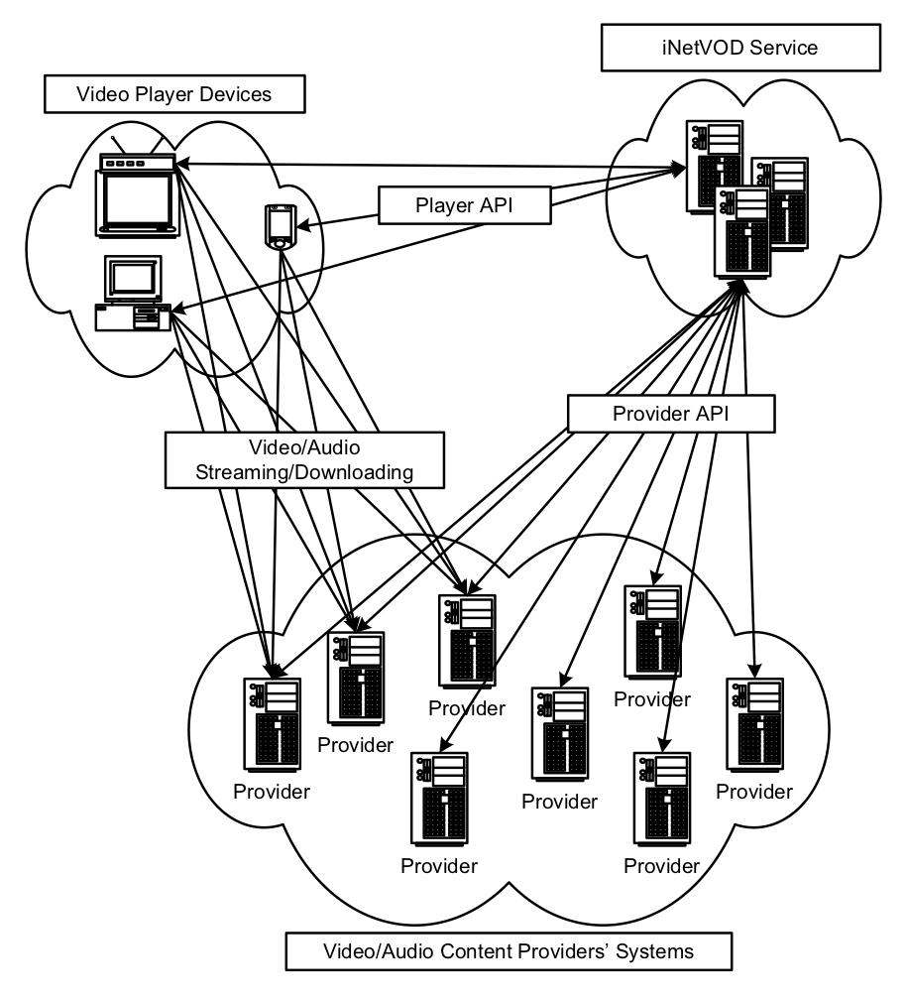
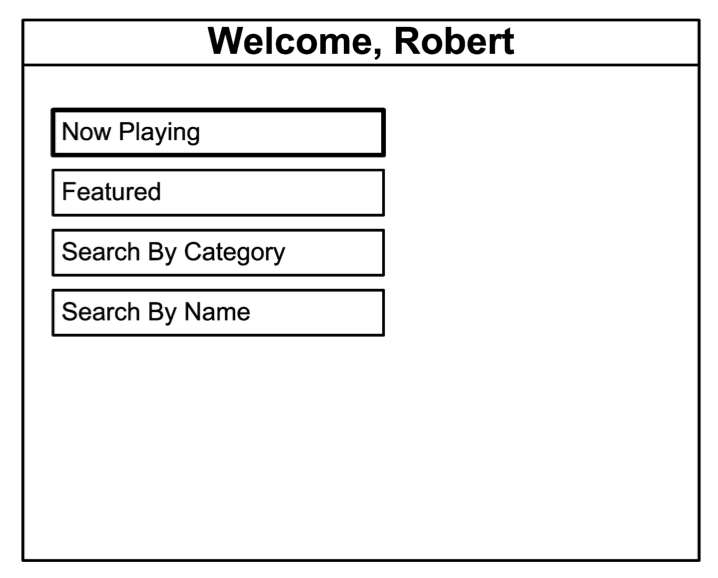
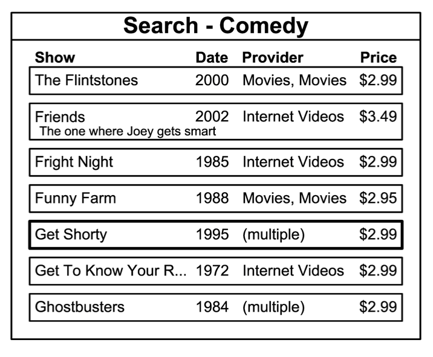
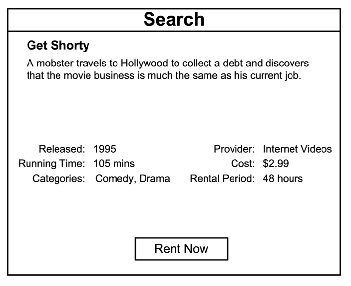
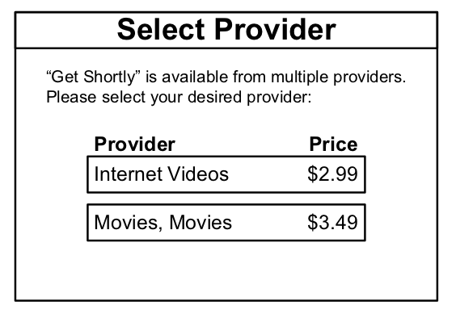
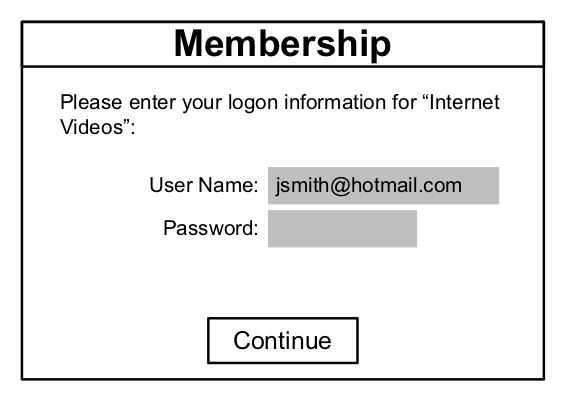

iNetVOD
=======
## Overview

The iNetVOD(sm) service is an Internet-based video-on-demand (VOD) system that provides multiple audio/video player devices with a single point of access to audio/video content provided by a multitude of content providers.

Multiple player devices (set-top boxes, DVD players, personal video recorders, personal computers, etc.) connect to the iNetVOD service to search for and access content from multiple content providers using a single API (application programming interface).  The iNetVOD system in turn connects to various content providers’ systems to perform the requested tasks.  Once the proper access requirements have been fulfilled, the player devices stream or download the desired content from the particular content provider.

### The Player Device

The iNetVOD service is accessed by users through a custom user interface (UI) built into the player device.

As an example, consider a networked-DVD player connected to a television set.  The TV would display the user interface from the DVD player.  Using their DVD player’s remote control, the user would enter the iNetVOD menu screen:

From here, the user performs a search and comes up with shows that match their criteria:

Selecting a particular show displays the details of the show:

Upon selecting the “Rent Now” button, the DVD player notifies the iNetVOD service of the rent request.  The iNetVOD service in turn notifies the specified provider.  The provider authenticates the request, charges the user’s account for the rental, then returns the proper credentials for accessing the show.  These credentials are returned to the DVD player which begins downloading or streaming the show and displays the show on the TV screen.

For shows that are available from multiple providers, a prompt is shown allowing the user to select the desired provider:

### Content Providers’ Membership

The iNetVOD service was not designed as a service to store and maintain content.  None of the content available through iNetVOD is maintained in iNetVOD’s system.

Instead, the iNetVOD service provides a single access point to allow users to access content from multiple providers using their own credentials for the provider.

For example, let’s say John Smith has a membership with an Internet VOD provider called ‘Internet Videos’.  Let’s say John’s UserID at ‘Internet Videos’ is jsmith@hotmail.com.

John, using his networked-DVD player that supports the iNetVOD service, desires to rent a movie from ‘Internet Videos’ via the iNetVOD service.  Upon his first rental attempt, the DVD player would prompt John for his credentials at ‘Internet Videos’:

As part of the rental request, these credentials are passed from the DVD player to the iNetVOD service, which in turn passes the credentials to the content provider.  The content provider uses these credentials to determine which user membership account to process the rental against.

In essence, the player device performs the same functions as a web browser in terms of accessing Internet-based VOD content.  Each content provider retains full control of their clients and their clients’ accounts.  Credentials gathered by the players are stored security, just as a web browser may store logon information for various web sites.

If so desired, the user may choose to store the credentials on the iNetVOD servers, locally on the player device, or not at all.  In this last case, the user would be prompted for the credentials each time they are needed.

Copyright (c) 2005-2006 iNetVOD, Inc.

### Patents

iNetVOD is an implementation fo the following patents:

[US7555465](https://patents.google.com/patent/US7555465), [US7925593](https://patents.google.com/patent/US7925593) -
Service and method for providing a single point of access for multiple providers' video and audio content

### Player API Reference

This document defines the application programming interfaces (API) of requests/responses between a player device that is part of the iNetVOD(sm) service and the iNetVOD(sm) servers.

[Full Specification](files/iNetVOD%20Player%20API.pdf)

### Player UI Reference

This document defines a reference implementation for a user interface on a player device that is part of the iNetVOD(sm) service.

[Full Specification](files/iNetVOD%20Player%20UI%20Reference.pdf)

### Provider API Reference

This document defines the application programming interfaces (API) of requests/responses between a content provider server that is part of the iNetVOD(sm) service and the iNetVOD(sm) servers.

[Full Specification](files/iNetVOD%20Provider%20API.pdf)

## Projects

### [Web API](https://github.com/grtvd/inetvod-webapi)

The heart of iNetVOD, a web-based service accepting Player API requests from player devices via and calling our to provider servers via the Provider API.

### [API Service]()

A periodic task runner for performing various updates, such as updating available provider content.

### [Web App](https://github.com/grtvd/inetvod-webapp)

Project for StormMediaPlayer.com, a web-based implementation of a player device supporting the Player API.

### [Media Player Edition (MCE)](https://github.com/grtvd/inetvod-mce)

A Microsoft Windows Media Player Edition implementation of a player device supporting the Player API.

### [Download Service](https://github.com/grtvd/inetvod-dls)

A client Windows service that downloads content in the background, allowing for faster, offline playback.

### [Mobile](https://github.com/grtvd/inetvod-mobile)

A simple "mobile" web-based implementation of a player device supporting the Player API.

### [Widget](https://github.com/grtvd/inetvod-widget)

A simple, partial implementation of a player device supporting the Player API.

### [Content Manager](https://github.com/grtvd/inetvod-contmgr)

A helper Web API and background service for managing access to free content available via RSS type feeds.

### [Shared](https://github.com/grtvd/inetvod-shared)

Code shared across multiple iNetVOD projects.

### [Web Provider](https://github.com/grtvd/inetvod-webprovider)

A reference implementation of the Provider API, to be used for illustration.

### [Schemas](https://github.com/grtvd/inetvod-schemas)

Web exposed XML schemas for Player and Provider APIs.

### [iNetVOD Website](https://github.com/grtvd/inetvod-website)

The iNetVOD, Inc. corporate website.

